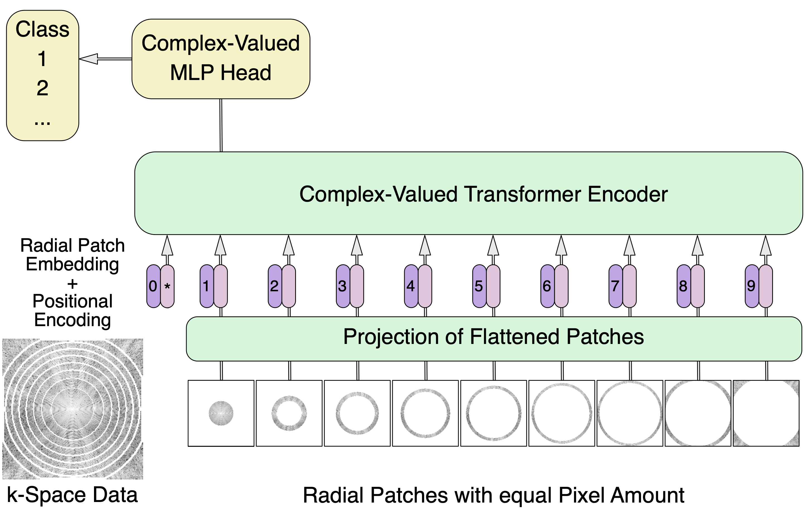

[](https://www.python.org/downloads/release/python-3120/) 
[](https://github.com/psf/black)
[](./LICENSE)
</a>
<div align="center">

[Project Structure](#project-structure) • [Installation](#installation) • [Usage](#usage) • [Features](#features) • [Reproducibility](#reproducibility) • [Citation](#citation)

</div>

# Efficient complex-valued Vision Transformers for MRI Classification Directly from k-Space

This is the official PyTorch implementation of the paper:

**Efficient complex-valued Vision Transformers for MRI Classification Directly from k-Space**

We propose a novel complex-valued Vision Transformer (kViT) architecture that directly processes k-Space data for MRI classification tasks. A radial patching strategy is introduced to efficiently handle the non-Cartesian nature of k-Space, significantly reducing computational overhead.

<p align="center">
    
</p>

## Project Structure

```
src/
├── configs/                    # Configuration files for training
│   ├── train_image_2D.yaml     # 2D image classification config
│   ├── train_image_MIL.yaml    # MIL image classification config
│   ├── train_kspace_2D.yaml    # 2D k-space classification config
│   └── train_kspace_MIL.yaml   # MIL k-space classification config
├── model/                      # Model architectures
│   ├── image_classification.py # Image-domain models (ResNet, ViT, etc.)
│   ├── cTransformer.py         # K-space transformer models
│   └── complex_layer/          # Complex-valued layers for k-space
├── utils/                      # Utilities and helper functions
│   ├── dataset.py              # Dataset loaders and preprocessing
│   ├── metrics.py              # Evaluation metrics
│   ├── utilities.py            # Training utilities
│   └── fastmri/                # FastMRI-specific utilities
├── tests/                      # Unit tests
├── train_image.py              # Training script for image models
├── train_kspace.py             # Training script for k-space models
├── test_model_2D.py            # Testing script for 2D models
└── test_model_mil.py           # Testing script for MIL models
```

## Installation

### Requirements
- Python 3.12+
- PyTorch 2.0+
- CUDA 11.0+ (for GPU support)

### Setup
```bash
# Clone the repository
git clone https://github.com/TIO-IKIM/kViT.git
cd kViT

# Install dependencies
pip install -r requirements.txt
```

## Usage

We provide our full code for training and evaluating models. If you just want to reproduce the results from the paper, you can simpy run the scripts in the `src/reproduce/` folder.

For this you first have to download the FastMRI dataset (knee or prostate), split the single-coil 3D k-Space volumes into 2D slices, and create CSV files as shown in `data`. For further details on how to prepare the data, please refer to the FastMRI [documentation](https://github.com/facebookresearch/fastMRI/tree/main).
The final 2D PyTorch Tensors should have the shape `(height, width)` and be complex-valued (dtype: `torch.complex64`).

### Training

The training scripts support flexible configuration through YAML files:

#### 1. Image-Domain Training (2D)
```bash
python src/train_image.py --config src/configs/train_image_2D.yaml --gpu 0
```

#### 2. K-Space Training (2D)
```bash
python src/train_kspace.py --config src/configs/train_kspace_2D.yaml --gpu 0
```

#### 3. Multiple Instance Learning (MIL)
```bash
python src/train_image.py --config src/configs/train_image_MIL.yaml --gpu 0
```

### Command-Line Arguments
- `--config`: Path to configuration YAML file (required)
- `--gpu`: GPU device ID (default: 0)
- `-e`: Number of epochs (overrides config)
- `-c`: Path to checkpoint folder for resuming training
- `-s`: Use single train/val split instead of cross-validation
- `--tqdm`: Disable tqdm progress bar

### Configuration Files

Each config file controls:
- **Dataset**: CSV path, preprocessing, augmentation
- **Model**: Architecture (ResNet, ViT, kViT), hyperparameters
- **Training**: Learning rate, batch size, optimizer, epochs
- **Mode**: 2D vs MIL, image vs k-space

See examples in the `configs` folder.

### Testing

Evaluate trained models on test sets:

```bash
# Test 2D model
python src/test_model_2D.py \
  --checkpoint output/train_0.0001_best_run/fold_0/best_checkpoint.pth \
  --config src/configs/train_kspace_2D.yaml \
  --csv data/test.csv

# Test MIL model
python src/test_model_mil.py \
  --checkpoint output/train_0.0001_best_run/fold_0/best_checkpoint.pth \
  --config src/configs/train_kspace_MIL.yaml \
  --csv data/test.csv
```

The test scripts report:
- Classification metrics (accuracy, precision, recall, F1, AUC)
- Confusion matrix (saved to checkpoint folder)
- Attention Maps and (in case of MIL) slice importance

### Cross-Validation

By default, training uses 5-fold cross-validation with patient-level splitting. To use a single train/val split:

```bash
python src/train_image.py --config src/configs/train_image_2D.yaml -s
```

## Features

### Dataset Support
- **FastMRI**: Knee and prostate MRI datasets
- **Custom datasets**: Define via CSV files with columns: `path`, `label`, `Patient_id`
- **(k-Space-specific) Augmentation**: Rotation, flip, cut-out, undersampling

### Models
- **Image models**: ResNet50, EfficientNet, Vision Transformer
- **k-Space models**: Custom transformer architecture with complex-valued layers
- **MIL models**: Attention-based pooling for sequence classification


## Reproducibility

The results of our experiments can be reproduced by running the following scripts:

```bash
# Reproduce ResNet results on prostate data
bash src/reproduce/ResNet_prostate.sh

# Reproduce kViT results on prostate data
bash src/reproduce/kViT_prostate.sh
```
All other models can be trained by adjusting the config files accordingly.

All random seeds are fixed for reproducibility (seed=1).

## Citation

If you use this code for your research, please cite:

```

```

## Contact

For questions or issues, please open a GitLab issue.
